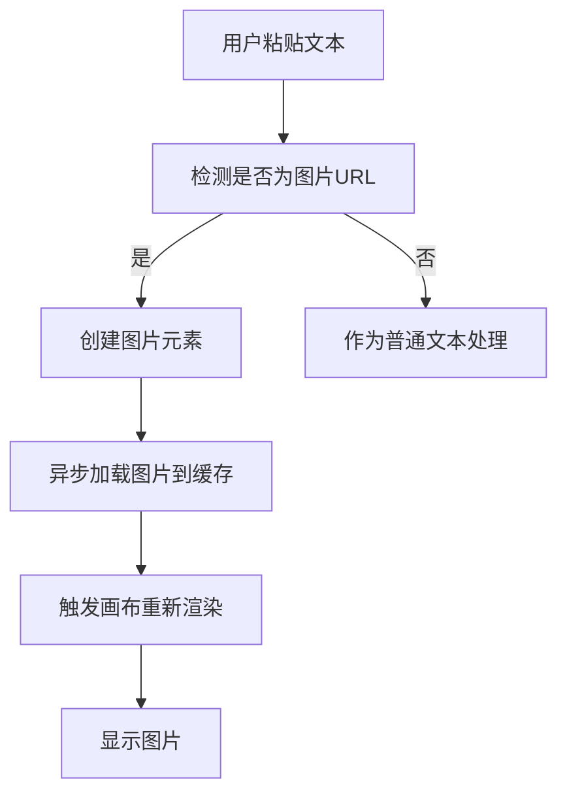

# 图片URL粘贴功能使用指南

## 功能概述

Excalidraw 现在支持直接粘贴图片URL文本到画布上，系统会自动识别并显示图片。这个功能让用户可以快速添加网络图片到绘图中，无需先下载图片文件。

## 核心特性

### 1. 智能URL识别
系统能够智能识别多种格式的图片URL：

- **文件扩展名识别**: `.jpg`, `.png`, `.gif`, `.webp`, `.svg` 等
- **知名图片服务**: Unsplash, Imgur, Pixabay, Pexels 等
- **路径模式**: 包含 `/image`, `/photo`, `/media` 等关键词的URL
- **API参数**: 包含 `format`, `width`, `height` 等参数的图片API

### 2. 网络图片缓存
- 自动缓存已加载的网络图片，提高渲染性能
- 支持异步加载，不阻塞界面操作
- 智能错误处理和重试机制

### 3. 数据存储优化
- 保存时只存储图片URL，不保存二进制数据
- 大幅减少文件大小，提高加载速度
- 支持跨设备共享（只要图片URL可访问）

## 使用方法

### 基本使用

1. **复制图片URL**: 从浏览器地址栏或右键菜单复制图片链接
2. **粘贴到画布**: 在Excalidraw画布上按 `Ctrl+V` (Mac: `Cmd+V`)
3. **自动显示**: 系统自动识别URL并在画布上显示图片

### 支持的URL示例

```
# 直接图片链接
https://example.com/image.jpg
https://cdn.example.com/photos/sunset.png

# 图片服务
https://images.unsplash.com/photo-1506905925346-21bda4d32df4
https://picsum.photos/400/300
https://via.placeholder.com/300x200.png

# API图片
https://api.example.com/image?id=123&format=png&w=400
```

## 开发集成

### 基本配置

```typescript
import { Excalidraw } from "@excalidraw/excalidraw";

function App() {
  return (
    <Excalidraw
      // 可选：配置图片上传服务（用于本地图片文件）
      imageUploadConfig={{
        uploadUrl: "https://your-api.com/upload",
        method: "POST",
        formDataFieldName: "file",
      }}
      
      onChange={(elements, appState, files) => {
        // 监听画布变化
        const networkImages = elements.filter(el => 
          el.type === 'image' && el.imageUrl
        );
        console.log('网络图片数量:', networkImages.length);
      }}
    />
  );
}
```

### ZZ-Infra服务集成

```typescript
import { zzInfraConfig } from "@excalidraw/excalidraw/data/zzInfraConfig";

function App() {
  return (
    <Excalidraw
      imageUploadConfig={zzInfraConfig}
      // 其他配置...
    />
  );
}
```

### 自定义上传配置

```typescript
const customUploadConfig = {
  uploadUrl: "https://your-api.com/upload",
  method: "POST",
  headers: {
    "Authorization": "Bearer your-token",
  },
  formDataFieldName: "image",
  maxFileSize: 5 * 1024 * 1024, // 5MB
  allowedTypes: ['image/jpeg', 'image/png', 'image/gif'],
  
  // 自定义上传逻辑
  customUpload: async (file, config) => {
    const formData = new FormData();
    formData.append(config.formDataFieldName, file);
    
    const response = await fetch(config.uploadUrl, {
      method: config.method,
      headers: config.headers,
      body: formData,
    });
    
    const result = await response.json();
    return result.imageUrl; // 返回图片URL
  },
};
```

## 技术实现

### 核心组件

1. **clipboard.ts**: 粘贴事件处理和URL检测
2. **imageHandler.ts**: 图片处理和元素创建
3. **networkImageCache.ts**: 网络图片缓存管理
4. **imageUpload.ts**: 图片上传服务集成

### 处理流程



### 类型定义

```typescript
// 扩展的图片元素类型
interface ExcalidrawImageElement {
  type: "image";
  fileId: FileId | null;
  imageUrl?: string | null; // 新增：网络图片URL
  status: "pending" | "saved" | "error";
  // ... 其他属性
}

// 图片上传配置
interface ImageUploadConfig {
  uploadUrl: string;
  method?: 'POST' | 'PUT';
  headers?: Record<string, string>;
  formDataFieldName?: string;
  maxFileSize?: number;
  allowedTypes?: string[];
  customUpload?: (file: File, config: ImageUploadConfig) => Promise<string>;
}
```

## 测试和调试

### 测试页面

项目提供了多个测试页面：

- `examples/debug-image-paste.html`: 调试页面，显示详细的处理过程
- `examples/complete-image-paste-demo.html`: 完整的Excalidraw演示
- `examples/simple-image-paste-test.html`: 简单的URL检测测试

### 常见问题

1. **图片不显示**
   - 检查图片URL是否可访问
   - 确认图片服务器支持CORS
   - 查看浏览器控制台错误信息

2. **URL未被识别**
   - 确认URL格式正确
   - 检查是否包含支持的图片特征
   - 查看 `detectImageUrlFromText` 函数逻辑

3. **加载缓慢**
   - 图片服务器响应速度影响
   - 网络连接质量
   - 图片文件大小

## 最佳实践

### 性能优化

1. **使用CDN**: 选择响应速度快的图片CDN服务
2. **合适尺寸**: 避免使用过大的图片文件
3. **缓存策略**: 利用浏览器缓存和应用缓存

### 用户体验

1. **加载提示**: 显示图片加载状态
2. **错误处理**: 提供友好的错误信息
3. **快捷操作**: 提供常用图片URL的快速访问

### 安全考虑

1. **URL验证**: 验证图片URL的安全性
2. **HTTPS**: 优先使用HTTPS图片链接
3. **内容过滤**: 避免加载不当内容

## 更新日志

### v1.0.0
- ✅ 实现图片URL文本粘贴功能
- ✅ 支持多种URL格式识别
- ✅ 网络图片缓存机制
- ✅ ZZ-Infra服务集成
- ✅ 完整的测试和文档

## 贡献

欢迎提交Issue和Pull Request来改进这个功能。在提交代码前，请确保：

1. 运行所有测试用例
2. 更新相关文档
3. 遵循项目的代码规范

## 许可证

本功能遵循Excalidraw项目的MIT许可证。
